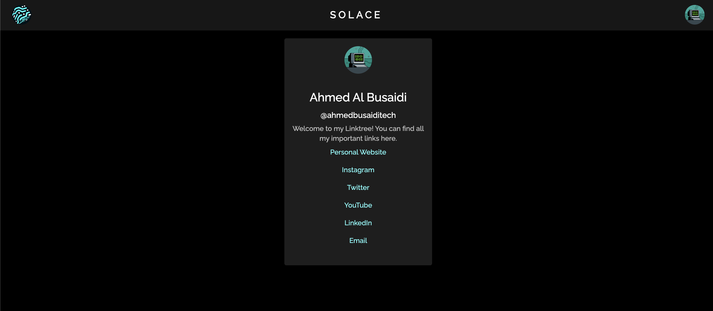

<div style="text-align: center;">
<h1 align="center">
    Solace
    <br />
    <br />
    
</h1>


</div>
<hr />


<div style="text-align: center;">
    
</div
## Table Of Contents

- [Table Of Contents](#table-of-contents)
- [The Problem](#the-problem)
- [The Solution](#the-solution)
- [Getting Started](#getting-started)
- [Prerequisites](#prerequisites)
- [Installation](#installation)
- [Usage](#usage)
- [Deployment](#deployment)
- [Components](#components)

## The Problem 
In the digital age, individuals and businesses rely heavily on social media and online platforms to connect with their audience, share content, and showcase their work. One common challenge faced by users is the limitation of having a single link in their social media bios to direct their followers to various online profiles, websites, and content. Existing solutions like LinkTree offer a way to consolidate links, but they often lack the level of customization and personalization required to truly represent the uniqueness of each user's brand or identity.

Our project aims to address this problem by creating a more versatile and customizable alternative to traditional link-sharing platforms. By offering enhanced features and allowing users to have greater control over the presentation and arrangement of their links, we strive to provide a solution that caters to a wider range of individuals and businesses seeking to maximize their online presence.

The main challenges to be tackled include:

1. **Limited Customization:** Existing platforms offer a standardized layout, which might not align with users' branding and style preferences. Our solution seeks to empower users with a variety of customization options to create a link-sharing page that resonates with their unique identity.

2. **User-Friendly Interface:** Many users may not possess advanced technical skills. Designing an intuitive and user-friendly interface is crucial to ensure that users can effortlessly set up and manage their personalized link-sharing pages without any barriers.

3. **Mobile Responsiveness:** With the increasing use of mobile devices, it is imperative that our solution provides a seamless experience across different screen sizes, ensuring that users' link-sharing pages are accessible and visually appealing on both desktop and mobile platforms.

4. **Data Privacy and Security:** As users will be sharing their online profiles and websites, maintaining robust data privacy and security measures is of paramount importance. Striking a balance between customization and security is a critical aspect of our project.

5. **Scalability:** As the user base grows, the platform must remain reliable and performant, even during peak usage periods. Ensuring the scalability of the infrastructure and optimizing loading times will be key considerations.

By addressing these challenges, our project aims to offer a superior solution to the existing link-sharing platforms, providing users with a more flexible, personalized, and user-friendly way to showcase their digital presence and engage with their audience.

## The Solution
Our project seeks to revolutionize the way individuals and businesses share their online presence with a comprehensive and highly customizable link-sharing platform. By leveraging cutting-edge web technologies, user-centered design principles, and robust security measures, we aim to provide a solution that empowers users to create personalized link-sharing pages that reflect their unique brand identity while maintaining ease of use and data privacy.

Key features of our proposed solution include:

1. **Customization Options:** Our platform will offer a wide array of customization options, allowing users to choose from various themes, color schemes, fonts, and layout configurations. This flexibility ensures that users can tailor their link-sharing pages to align with their branding and personal style.


3. **Mobile Responsiveness:** Our platform will be designed with a mobile-first approach, ensuring that link-sharing pages look and function seamlessly across different devices. This responsive design guarantees a consistent user experience, regardless of whether visitors access the page from a desktop, tablet, or smartphone.

4. **Enhanced Analytics:** Understanding how visitors interact with their link-sharing pages is essential for users. We plan to incorporate detailed analytics and insights, allowing users to track click-through rates, engagement levels, and other relevant metrics to refine their online strategies.

5. **Data Privacy and Security:** We will implement robust security measures, including encryption protocols, secure authentication, and data anonymization, to safeguard users' information. Users will have control over the visibility of their links and can choose to make their link-sharing pages public or private.

6. **Scalable Infrastructure:** Our solution will be built on a scalable infrastructure, ensuring optimal performance even during high traffic periods. Cloud-based technologies will be employed to accommodate the growing user base and provide a seamless browsing experience.

7. **API Integrations:** Recognizing the importance of integrating with existing platforms, our solution will offer API integrations with popular social media networks, websites, and content sharing platforms, enabling users to effortlessly connect their online presence.

8. **User Support and Documentation:** We will provide comprehensive user documentation and support resources to assist users in setting up and customizing their link-sharing pages. User feedback will be actively collected and incorporated into ongoing improvements.

By offering a more advanced and user-centric solution that addresses the limitations of existing link-sharing platforms, our project aims to empower individuals and businesses to curate a dynamic and personalized online presence that effectively engages their audience, fosters brand identity, and supports their broader digital strategies.
<hr />


## Getting Started 
Follow these steps to quickly set up and run the project on your local machine.

### Prerequisites

Before you begin, make sure you have the following software installed:

- Node.js: You'll need Node.js to run the project. You can download it from [nodejs.org](https://nodejs.org/).

### Installation

1. **Clone the Repository**: Start by cloning this repository to your local machine using the following command:

   ```bash
   git clone https://github.com/TheOGRafiki/Solace.git
   ```

2. **Navigate to the Directory**: Change into the project directory:

   ```bash
   cd Solace
   ```

3. **Install Dependencies**: Install the project's dependencies using npm (Node Package Manager):

   ```bash
   npm install or npm i
   ```

### Configuration

1. **Auth0 Setup**: Configure your Auth0 authentication settings to enable user authentication. Update the Auth0 configuration in the appropriate files.

2. **MongoDB Backend**: Configure the MongoDB API endpoints to match your backend. Adjust the API URLs in the code to connect to your MongoDB instance.

### Running the App

Once you've completed the installation and configuration steps, you're ready to run the app locally.

1. **Start the Development Server**:

   ```bash
   npm run dev
   ```

   This will start the development server and open the app in your default web browser.

### Usage

- If you're authenticated, you'll see your profile card. Customize your profile details and explore the app's features.
- To search for a user profile by username, enter the username in the search bar and click the search icon.

### Contributing

If you'd like to contribute to the project, feel free to open issues, submit pull requests, and collaborate with the community.

## Deployment

We've set up continuous integration and deployment (CI/CD) for this project using Netlify. This means that every time you push changes to the `main` branch, Netlify will automatically build and deploy the updated app to a live environment.

### Prerequisites

Before you start the deployment process, ensure you have:

- A Netlify account: If you don't have one, you can sign up at [netlify.com](https://www.netlify.com/).

### Deployment Steps

1. **Configure Environment Variables**:

   Before deploying, ensure that you've configured any necessary environment variables, especially those related to Auth0 and MongoDB. You can usually set these variables in the Netlify dashboard under your project's settings.

2. **Push Changes to `main` Branch**:

   To trigger a deployment, simply push your changes to the `main` branch on your GitHub repository. This can be done through the GitHub web interface or using Git commands:

   ```bash
   git add .
   git commit -m "Update: Made some awesome changes"
   git push origin main
   ```

## Components

### App Component

The `App` component is the central entry point of the application, orchestrating the user interface, authentication, and data retrieval. This component leverages the Auth0 authentication library to manage user authentication and profile information. It also integrates Material-UI for styling and user interface components.

#### Features

- User Authentication: Utilizes Auth0's `useAuth0` hook to manage user authentication status and profile information.
- User Data Synchronization: Ensures user data synchronization with a MongoDB backend, updating user details such as name, email, profile picture, and username.
- ProfileCard Display: Renders a user profile card with the user's information using the `ProfileCard` component.
- Search Functionality: Enables users to search for profiles by username, fetching user data from the MongoDB backend.
- Stylish UI: Employs Material-UI theming and components for a visually appealing and responsive user interface.

#### Key Components

- `useAuth0` from `@auth0/auth0-react`: Manages user authentication and profile data.
- `ProfileCard` Component: Displays user information in a presentable card format.
- `ResponsiveAppBar` Component: Provides a responsive app bar for navigation and user interactions.
- `ThemeProvider` from `@mui/material`: Wraps the entire app in a Material-UI theme, ensuring consistent styling.
### AccountDialog Component

The `AccountDialog` component provides a user account management dialog that allows users to view and modify their profile information, change their password, resend verification emails, and perform account-related actions.

#### Key Features

- Display User Information: Displays the user's name, email, and profile picture.
- Profile Picture Interaction: Adjusts the profile picture's brightness on hover to provide visual feedback.
- Change Password: Enables users to change their password by entering and confirming a new password.
- Resend Verification Email: Provides the option to resend the account verification email if needed.
- Logout: Allows users to log out of their account.
- Delete Account: Offers the option to delete the user's account with proper confirmation steps.

#### Props

- `open` (boolean): Determines whether the dialog is open.
- `handleClose` (function): Callback function to close the dialog.

#### Usage

1. Import the `AccountDialog` component and the necessary Material-UI components.

   ```jsx
   import AccountDialog from "./AccountDialog";
   ```

2. Use the `AccountDialog` component within your application, passing the `open` and `handleClose` props.

   ```tsx
   <AccountDialog open={dialogOpen} handleClose={closeDialog} />
   ```


<hr />


### ProfileCard Component

The `ProfileCard` component displays user profile information, including name, username, bio, and links, in a card format. Users can view and interact with the profile details, and if authorized, they can edit the bio and links.

#### Features

- User Information Display: Displays the user's name, username, profile picture, bio, and associated links.
- Edit Functionality: If the user is authenticated and the profile matches their own, they can click on edit icons to modify the bio and links.
- Preview/Edit Toggle: Users can toggle between preview and edit mode by clicking the "Preview" or "Edit" button.

#### Usage

1. Import the `ProfileCard` component and the necessary Material-UI components.

   ```jsx
   import ProfileCard from "./ProfileCard";
   ```

2. Use the `ProfileCard` component within your application.

   ```jsx
   <ProfileCard />
   ```

Certainly, here's the description of the `ResponsiveAppBar` component for your GitHub README:

### ResponsiveAppBar Component

The `ResponsiveAppBar` component provides a responsive app bar that displays the Solace logo, brand name, user profile picture, and settings menu. It offers seamless navigation, user authentication, and options to manage the user profile.

#### Features

- Branding: Displays the Solace logo and brand name, which can be clicked to navigate back to the main page.
- User Authentication: Shows the user's profile picture and provides login functionality using Auth0's `useAuth0` hook.
- Settings Menu: Offers a dropdown menu with options to view the user's profile, manage account settings, and log out.
- Account Dialog: Includes the `AccountDialog` component to manage account-related actions.
- Responsiveness: Adapts to various screen sizes, ensuring a consistent user experience.

#### Usage

1. Import the `ResponsiveAppBar` component and the necessary Material-UI components.

   ```jsx
   import ResponsiveAppBar from "./ResponsiveAppBar";
   ```

2. Use the `ResponsiveAppBar` component within your application.

   ```jsx
   <ResponsiveAppBar />
   ```
Certainly, here's the description of the `UserContext` and related components for your GitHub README:

### UserContext and UserContextProvider

The `UserContext` and `UserContextProvider` components provide a way to manage and share user-related data throughout your application using the Context API. This allows you to store and access user information across different components without needing to pass props manually.

#### User Interface

- `User`: Interface defining user properties, such as bio, name, email, links, profile picture, and username.
- `Link`: Interface defining properties of user links, including title, URL, and description.

#### `UserContext` Context

- `UserContextValue`: Interface defining the shape of the context value, including `userInformation` and `setUserInformation` functions.

- `UserContext`: Context object created using `createContext`, providing access to the user information context.

- `useUserContext` Hook: Custom hook that returns the context value and ensures it's used within a `UserContextProvider`.

#### `UserContextProvider` Component

- `UserContextProviderProps`: Interface defining props for `UserContextProvider`, including the children components.

- `UserContextProvider`: Component that wraps its children with the `UserContext` context provider. It manages and provides the `userInformation` state and `setUserInformation` function to the context.

#### Usage

1. **Wrap App with `UserContextProvider`**:

   Wrap your app or the relevant components with the `UserContextProvider` to make the user information accessible throughout your application.

   ```jsx
   import { UserContextProvider } from "./UserContext";

   function App() {
     return (
       <UserContextProvider>
         {/* Your app content */}
       </UserContextProvider>
     );
   }
   ```

2. **Use `useUserContext` Hook**:

   In any component that needs access to user information, use the `useUserContext` hook to access the `userInformation` state and `setUserInformation` function.

   ```jsx
   import { useUserContext } from "./UserContext";

   function UserProfile() {
     const { userInformation, setUserInformation } = useUserContext();

     // Use userInformation and setUserInformation as needed
   }
   ```